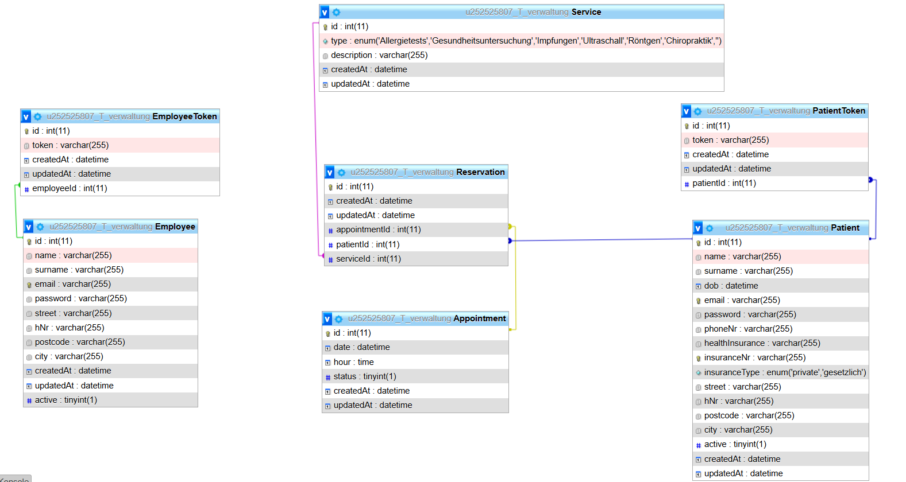

# MediBooker-API

## Description

Web-basierte App zur Verwaltung von Praxisterminen, ermöglicht Ärzten und medizinischem Personal das einfache Planen und Koordinieren von Patiententerminen. Eine ähnliche Implementierung kann unter [MediBooker API](https://medi-booker-ap-i.vercel.app/) eingesehen werden.

Before using the MediBooker-API, ensure you have Node.js and npm installed.
To set up the project, follow these steps:

https://auth-db972.hstgr.io/index.php?db=u252525807_T_verwaltung

### Install all dependencies:

npm install

### To start the server:

npm start

## Database Management

## Database Operations

To manage the database, use the following commands from the command line:

### To drop the database:

node drop-db.js

### To synchronize the database schema:

node sync-db.js

### To generate fake data for testing:

node fakedata.js

## Swagger

### To run the project and swagger Api Interface

node swagger.js

## Vercel

### To build the broject

vercel dev

### To deploy the Projekt

vercel --prod

## Docummentation

### WebSocket-Integration in der Anwendung

Diese Anwendung verwendet WebSockets, um Echtzeitkommunikation zwischen dem Server und den Clients zu ermöglichen. Die WebSocket-Implementierung erfolgt mithilfe von Socket.IO, das sowohl den Server- als auch den Client-Teil abdeckt.

#### Einrichtung von WebSockets

Die WebSocket-Server-Initialisierung und Ereignisbehandlung erfolgt in separaten Dateien im Verzeichnis `services/websockets`.

##### WebSocket-Server-Initialisierung

- **websocketInit.js**: Diese Datei initialisiert den WebSocket-Server durch die Funktion `initializeWebSocketServer`, die in der Hauptanwendungsdatei (`index.js`) aufgerufen wird.

##### WebSocket-Ereignisbehandlung

- **websocketHandlers.js**: Diese Datei behandelt die verschiedenen WebSocket-Ereignisse wie Verbindung, Nachricht und Trennung. Die Funktion `handleConnection` wird aufgerufen, wenn ein Client eine Verbindung herstellt.

##### WebSocket-Benachrichtigungen

- **websocketNotify.js**: Diese Datei enthält die Funktion `notifyClients`, um Benachrichtigungen an die verbundenen Clients zu senden. Die `setIo`-Funktion wird verwendet, um die `io`-Instanz zu setzen, die für die Benachrichtigung der Clients benötigt wird.

##### Einbindung des WebSocket-Servers

In der Hauptanwendungsdatei (`index.js`) wird der WebSocket-Server gestartet, nachdem der HTTP-Server erstellt wurde. Die `io`-Instanz wird gesetzt, um Benachrichtigungen an die Clients zu ermöglichen.

##### WebSocket-Ereignisse

Der WebSocket-Server kann auf spezifische Ereignisse hören und entsprechende Aktionen ausführen. Beispielsweise können bei Änderungen in der Datenbank (z.B. bei der Erstellung, Aktualisierung oder Löschung von Reservierungen) Benachrichtigungen an alle verbundenen Clients gesendet werden.

##### Vorteile der WebSocket-Integration

- **Echtzeitkommunikation**: Änderungen werden sofort an alle verbundenen Clients gesendet, wodurch eine Echtzeitkommunikation ermöglicht wird.
- **Effizienz**: WebSockets sind effizienter als wiederholte HTTP-Anfragen, da sie eine dauerhafte Verbindung zwischen Client und Server ermöglichen.
- **Benutzererfahrung**: Echtzeit-Updates verbessern die Benutzererfahrung erheblich, indem sie sicherstellen, dass die Benutzer immer aktuelle Informationen sehen.

Mit dieser Integration von WebSockets stellt die MediBooker-API sicher, dass alle relevanten Informationen in Echtzeit an die Benutzer weitergegeben werden, was die Effizienz und Benutzererfahrung der Anwendung erheblich verbessert.

### Fehlerbehandlung in der Anwendung

Diese Anwendung verwendet eine zentrale Fehlerbehandlungsmiddleware, um sicherzustellen, dass alle Fehler konsistent verarbeitet und protokolliert werden. Dies hilft, die Anwendung robuster und wartbarer zu machen.

#### Fehler-Middleware

Die Fehler-Middleware befindet sich im Verzeichnis middlewares und heißt errorHandler.js. Diese Middleware fängt alle Fehler ab, die in der Anwendung auftreten, protokolliert den Fehlerstack und sendet eine konsistente JSON-Antwort an den Client.

Protokollierung: Die Middleware protokolliert den Fehlerstack zur Diagnose.
Antwort: Eine JSON-Antwort mit dem Fehlerstatus und der Fehlermeldung wird an den Client gesendet.
Umgebung: Im Entwicklungsmodus (NODE_ENV=development) werden zusätzliche Fehlerinformationen gesendet.

#### Einbindung der Fehler-Middleware

Die Fehler-Middleware wird in der Hauptanwendungsdatei (index.js) eingebunden. Sie wird als letzte Middleware in der Middleware-Kette verwendet, um sicherzustellen, dass alle Fehler, die während der Verarbeitung von Anfragen auftreten, abgefangen werden.

#### Fehlerweitergabe in Controllern

In den Controllern und Routen wird sichergestellt, dass alle auftretenden Fehler an die Fehler-Middleware weitergegeben werden. Dies geschieht durch Aufrufen der next-Funktion mit dem Fehlerobjekt.

#### Vorteile der zentralen Fehlerbehandlung

Konsistenz: Alle Fehler werden auf die gleiche Weise behandelt und protokolliert.
Wartbarkeit: Änderungen am Fehlerbehandlungsverhalten müssen nur an einer Stelle vorgenommen werden.
Sicherheit: Im Produktionsmodus werden keine sensiblen Fehlerinformationen an den Client gesendet.
Diagnose: Im Entwicklungsmodus werden detaillierte Fehlerinformationen bereitgestellt, die bei der Diagnose und Behebung von Problemen helfen.
